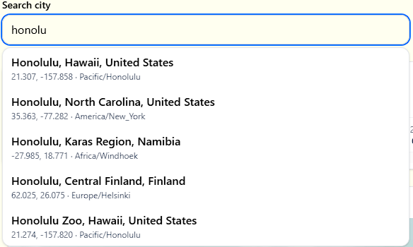
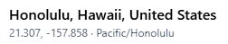
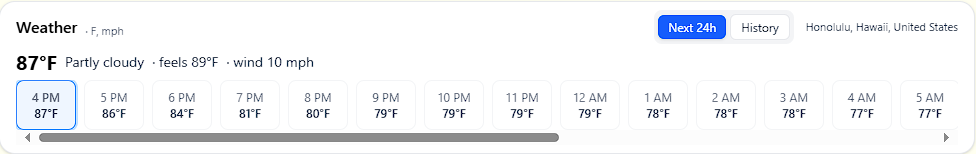
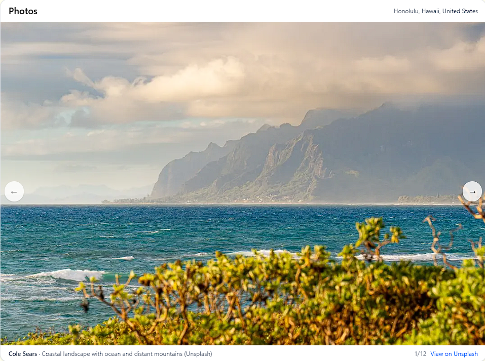
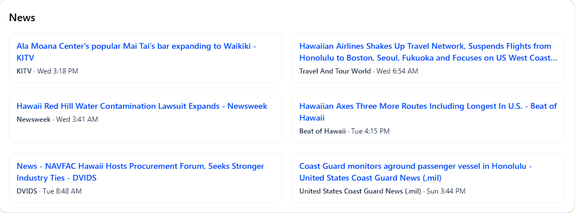
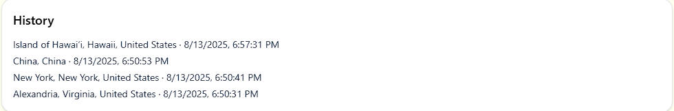
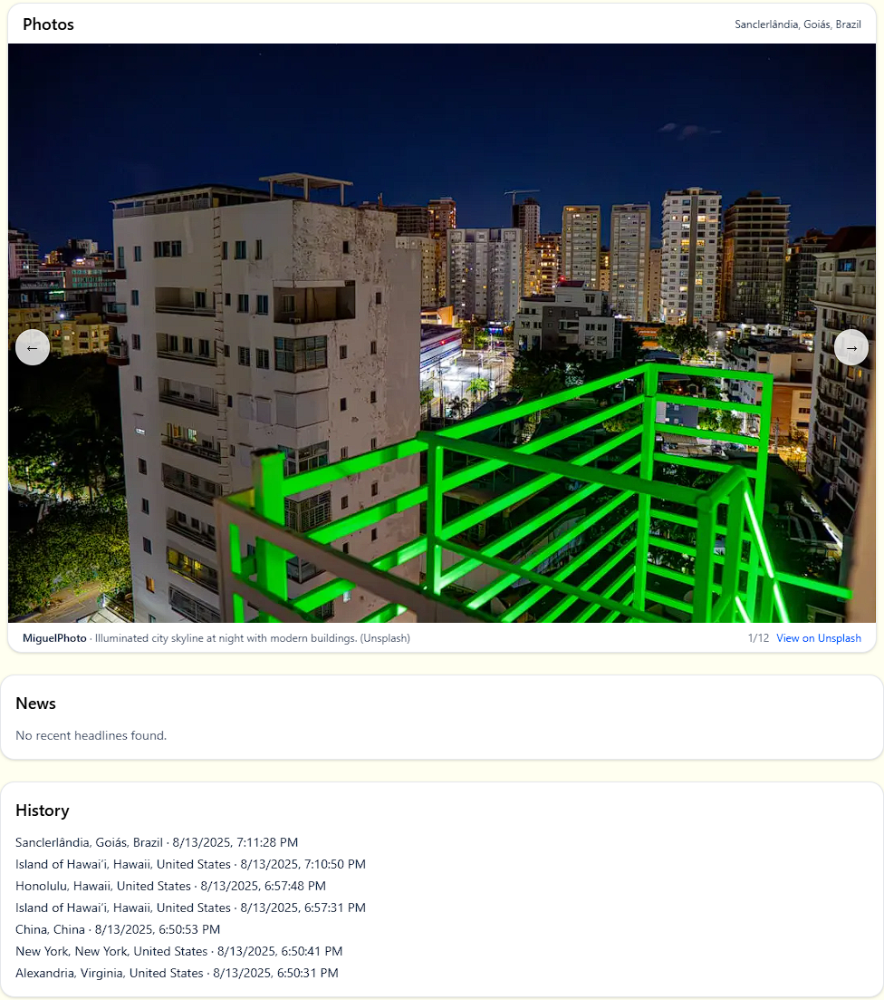
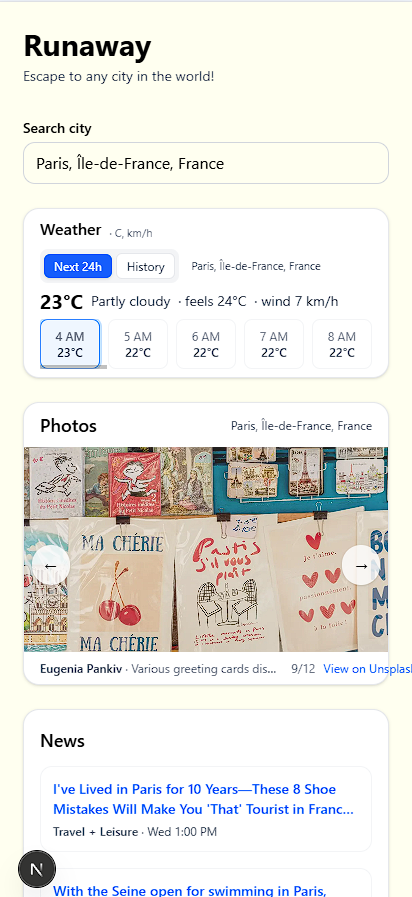

# Runaway

Runaway lets you virtually teleport to any city in the world without leaving home. In this MVP, pick a city and get **live weather**, **fresh photos**, and **recent news headlines**. It’s a single-page real-time “window” into the city’s vibe—designed for homesick users, curious explorers, and trip planners.

> **Demo video:** [`assets/Demo.mp4`](assets/Demo.mp4)

---

## ✨ Features

- **Autocomplete city search** — type part of a name and pick from suggestions  
  

- **Geocoding** — pass the city’s latitude/longitude/timezone to all features  
  

- **Current weather & today’s forecast** — automatic °F/°C based on locale + toggle between **24h forecast** or **12h history + 12h forecast**  
  

- **Fresh photos** — 12 high-quality recent images from Unsplash  
  

- **Recent news headlines** — top articles from the past 7 days  
  

- **History of searched cities** — using Mongoose, view your past 10 searches  
  

- **Independent cards** — each feature loads separately and won’t break others on failure  
  

- **Adaptive design** — works on mobile, tablet, and desktop  
  

---

## 🚀 Installation

Clone the repo:
```bash
git clone https://github.com/bnyg-yeah/Runaway-project.git
cd Runaway-project
```

Install dependencies:
```bash
npm install
```

Create your local env file (optional for Unsplash key; the app still runs without it):
```bash
cp .env.example .env.local
```

> For advanced testing, add your Unsplash key to `.env.local` as:
```ini
UNSPLASH_ACCESS_KEY=your_key_here
```

Run locally:
```bash
npm run dev
```

Then open [http://localhost:3000](http://localhost:3000) in your browser.

---

## 🧩 Technology Stack

- **Frontend:** Next.js (App Router) + React + TypeScript  
- **Styling:** Tailwind CSS  
- **State/Data fetching:** React Query (TanStack)  
- **Backend & API routes:** Next.js server functions  
- **Geocoding & Weather:** Open-Meteo — https://open-meteo.com/  
- **Photos:** Unsplash API — https://unsplash.com/developers  
- **News:** Google News RSS — https://news.google.com/  
- **History:** Mongoose (last 10 searches)

---

## 📡 API Documentation

### `GET /api/geocode`
Converts a city name to coordinates and metadata (via Open-Meteo geocoding).

**Query**
- `q` *(string, required)*  
- `count` *(number, 1–10, default 5)*  
- `countryCode` *(string, optional ISO code)*

**Response**
```ts
type Place = {
  city: string;
  region?: string | null;
  country: string;
  latitude: number;
  longitude: number;
  timezone: string;
};
```

---

### `POST /api/history`
Adds a city to the search history.

**Body**
```ts
{ city: string; region?: string | null; country: string }
```

**Response**
```ts
type ItemDTO = {
  id: string;
  city: string;
  region: string | null;
  country: string;
  viewedAt: Date;
};
```

---

### `GET /api/history`
Returns last 10 history items (newest first).

**Response**
```ts
{ items: ItemDTO[] }
```

---

### `GET /api/news`
Fetches recent headlines from Google News RSS.

**Query**
- `q` *(string, required)*  
- `hl` *(string, default "en-US")*  
- `gl` *(string, default "US")*  
- `n` *(number, 1–20, default 12)*  
- `og` *(string, "1" to fetch og:image)*

**Response**
```ts
type NewsItem = {
  title: string;
  link: string;
  source: string;
  publishedAtISO: string;
  imageUrl: string;
};
```

---

### `GET /api/photos`
Searches Unsplash for city images.

**Query**
- `q` *(string, required)*  
- `n` *(number, 1–24, default 12)*

**Response**
```ts
type Photo = {
  title: string;
  link: string;
  author: string;
  thumb: string;
  full: string;
  publishedAtISO: string;
};

type PhotosResponse = {
  items: Photo[];
  mode: "key" | "anonymous"; // whether Unsplash key was used
};
```

---

## ⚠️ Known Issue
- The search bar shows **“No places found”** after selecting a city. It’s technically correct, but not ideal UX.  
- Free API tiers (e.g., Unsplash without key) may yield fewer or older photos.

---

## 🧭 Roadmap (Future Development)
- **Sound element:** stream local radio stations to enhance immersion  
- **Live video:** embed city webcams for real-time visuals

---

## 🛠 Project Scripts (Quick Reference)
```bash
npm run dev     # start dev server
npm run build   # production build
npm start       # run production build locally
```

---

## 📬 Contact
You may contact me at **bnyg@vt.edu**.
